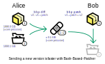

# BBP: Sukender's Bash-Based Patcher

## Description
Simple diff/patch of directories.



### Goals
- Maintain a (remote) directory up-to-date. The "maintainer" sends updates to "users". This is a kind of mirror (not a backup).
- Distribute **small** updates (which may not take forever to upload/download), even when the target is hundreds of gigabytes.
- Be a simple & basic toolset. This is why it is only a simple wrapper around commonly used GNU/Linux tools. Toolset is not necessarily user friendly nor error-proof.
  - BBP uses either [xdelta3](http://xdelta.org/) or [rdiff](https://linux.die.net/man/1/rdiff) as a diff/patch tool.
- Be used by anyone, anywhere (hence the choice of a [permissive license](LICENSE.md)).

## Features
- Create the smallest possible "patch" (difference) between two directories, and then apply the patch to a directory and get an updated one.
- Support archives: ```tar.xz``` archives of directories can be used in place of the directories. The ```bbp ar``` command can be used to create compatible archives.
  - Only one archive type is currently supported. You will not be able to use your previously "zipped" folder unless you extract it.
- Be "portable". Actually the bash scripts should run on (at least) common *GNU/Linux* distributions (Debian, Ubuntu...) and *Cygwin*.
  - Please note that even if targeted at the *bash* interpreter, this may work with others, or be easily adapted.

### Examples
#### Basic
```bash
# On a first machine:
bbp diff "oldDir" "newDir"          # Generate the patch ("Patch_(oldDir)_to_(newDir).xz")
blah-blah-blah                      # Upload generated file somewhere, say "some.server.com/patch.xz"

# On a second machine:
bbp patch "oldDirCopy" -g https://some.server.com/patch.xz      # Download and apply patch
```

#### Archives
Directories and tar.xz archives are used the same way and are exchangeable.
```bash
# On a first machine:
                                    # I want to archive my (heavy) "oldDir", but keep it bbp-compatible.
bbp ar "oldDir"                     # Using 'bbp ar', with default archive name ("oldDir.reference.tar.xz").

bbp diff "oldDir.reference.tar.xz" "newDir"     # Now generate the patch, but use the newly created "reference"
                                                # archive in place of the source directory.
                                                # Note we can do the same with "newDir".

# On a second machine:
bbp patch "oldDir.reference.tar.xz" -p "patch.xz"    # Apply, using a local patch (option '-p').
```

## Future work & ideas
### To-do
Stuff that should be done:
- [```bbppatch```] Upon failure, cleanup everything: delete or rename patched directory, pipes and temporary downloaded patch.
- [```bbpar```] Add progress bar for decompression.
- ```make install``` should have a way to configure install path.
- Add a resilience towards "small changes" in base directories (maintainer and users).
  - "Small changes" has to be clearly defined.
  - The goal is to allow both sides (maintainer & users) to tweak some files (say, config files), and still make the patch work properly.
  - Allowed changes may be somewhat hard-coded. Ex : a list of files that must be completely included in the patch when changed, even if a portion of them would suffice to describe differences.
- Allow exclusions, to "skip" paths (files or directories), as if they were removed from the base ('old'). This would allow patching a **part** of a directory.
  - Open question: how can we be sure to get the same filter when applying the patch?

### Maybe to-do
Nice ideas that may require too much amount of work regarding to the usefulness of the feature:
- [```bbpdiff```] Handle upload of patches (FTP or such).
- Add support for custom archives (anything, not just ".tar.something") as base directory (both for diff and patch).
  - This may imply issues in creating proper diffs.
- Add an option for in-place patching.
- Add better progress bars display.
- [```bbppatch```] Add better patch name auto-detection: list available patches (with the same 'old' part), and try to guess the highest version if multiple are found.

### Will probably never be done
...beacause the toolset is supposedly basic:
- Translation into another language than English (even though this is not my mother tongue language).

### Won't-do
What is was not meant for:
- The toolset is not designed to get cool/beautiful installers. This is only an ugly command line maintaining two directories. Maybe building a GUI ontop of it would be clever.

## Author
- **Sukender** (Benoit NEIL) - sukender at free dot fr
- Maybe you? Feel free to participate!
See also the list of [contributors](https://github.com/Sukender/bash-based-patcher/contributors) who participated in this project.
